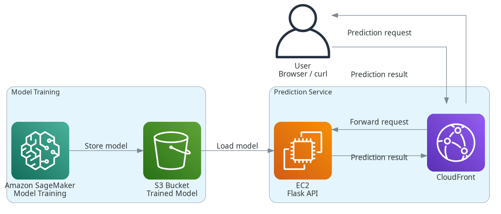

# Practical Session on Using CloudFormation, Machine Learning model development and deployment on AWS Cloud

In this exercise, you will develop and deploy a simple linear regression model on AWS. The exercise enables you to practice the following key AWS services, S3, SageMaker, EC2, CloudFormation, VPC, Internet Gateway, Subnet, Security Group, Route Table and IAM. In addition, it provides a solid structure of ecosystem to develop a secure, scalable machine learning app.

---

# Step 1. Preparation
## 1.1. Install Amazon CLI
```
apt update
apt install awscli
```
#if the above command does not work, use the following to install awscli
```
curl "https://awscli.amazonaws.com/awscli-exe-linux-x86_64.zip" -o "awscliv2.zip"
sudo apt install unzip -y
unzip awscliv2.zip
sudo ./aws/install
```

## 1.2. Configure Credentials
When prompted, enter the key and secret provided after you created the sandbox.

`aws configure`

AWS Access Key ID []: the key in the sandbox

AWS Secret Access Key []: the secret in the sandbox

Default region name []: 

Default output format []: 

## 1.3. Create Key Pair
After you configure the credentials, run the following command to generate the key pair on your local machine.
`aws ec2 create-key-pair   --key-name exam-score-server-key   --query 'KeyMaterial'   --output text > exam-score-server.pem`

Then set its permission using `chmod 400 exam-score-server.pem`

If you are working on WSL, you need to move the key file to `~/.ssh`. Otherwise the permission setting won't take effect.

## 1.4 Get your public Ip

You can get your public IP using the command:
- in Linux 
	- `curl -4 ifconfig.me` or `curl -4 https://icanhazip.com` 
- In Windows, run:
	`(Invoke-RestMethod -Uri "https://api.ipify.org")`

---

# Step 2. Setting up the Infrastructure
After you create the key pair, you can run the following command to create the infrastructure, i.e., VPC, Subnet, EC2, Security Group, Internet Gateway, Route Table. 
## 2.1 Create the CloudFormation template
You can download the [CloudFormation template file](exam-score-ml-stack.yml) included in this project. You may change it to suit your needs.

## 2.2 Create the stack
```
aws cloudformation create-stack \
--stack-name exam-score-server \
--template-body file://exam-score-ml-stack.yml \
--parameters \
   ParameterKey=KeyName,ParameterValue=exam-score-server-key \
  ParameterKey=BucketName,ParameterValue=my-ml-bucket-2108 \
   ParameterKey=MyIp,ParameterValue=your public ip/32
```
The S3 bucket name needs to be globally unique. 

## 2.3 Verify the stack creation
Verify if the stack is created using:
`aws cloudformation describe-stacks --stack-name exam-score-server`

Or if you need more detailed information about the events,
`aws cloudformation describe-stack-events --stack-name exam-score-server`

You can also verify if the individual AWS services are created using the console.

You can also verify by using the AWS console: **CloudFormation** --> **Stacks**

In case you see the status correspoding to your stak name a value different from `CREATE_COMPLETE`, you can get more details about the events. You can see the events by clicking the stack name and opening the **Events** tab.

---

# Step 3. Prepare the Data
## 3.1 Upload data to S3 Bucket
Upload dataset to data folder of S3 bucket using `aws s3 cp path-to-data s3://bucket-name/path-to-data

Example:

```
aws s3 cp data/exam_scores.csv \
        s3://my-ml-bucket-2108/data/exam_scores.csv
```

# Step 4. Build the Model
## 4.1 Build and Deploy Model on SageMaker

Use the [Notebook](exam-score-linear-regression-example.ipynb) to build the model and upload it to S3 on On SageMaker.

---

# Step 5. Inference

## 5.1. Setup the EC2 Server
### 5.1.1 Connect to the EC2 server via ssh
ssh -i ~/.ssh/exam-score-server.pem ubuntu@public-ip-of-EC2-Instance

### 5.1.2 Create python virtual environment. Install if you need to.
`sudo apt update`

`sudo apt install python3.12-venv`

`python3 -m venv .venv`

`source .venv/bin/activate`

## 5.1.3 Install required libraries
`pip install -r requirements.txt`

### 5.1.4 Do you need to store credentials on EC2 instance?
But before you run the file [download_model.py]("download_model.py") with `python download_model.py`, you may need to first set the credentials. If that is the case, run the command in Step 1.1 and Step 1.2 above on the EC2 server.

## 5.2 Download the Model and Perform Prediction
Then create the `predict.py` file on the EC2 server. The `predict.py` file downloads the model from S3 and runs it when you execute it with `flask --app predict run --host 0.0.0.0 --port 8000 &`. The `&` is needed to run the flask app in the background. By doing so, you cna run other commands on the same terminal. If you omit `&`, you may have to start another terminal, connect to EC2 via ssh and run the next command.

Finally, on 
`curl "http://localhost:8000/predict?hours=8"`

You should see, 
`{"hours_studied":8.0,"predicted_score":74.88}`

Congratulations! 
You have completed developing and deploying an end-to-end machine learning model on AWS!

---

# 6. Next: Security and Cost Considerations
## 6.1 Security -> Storing Access Keys on EC2?
You generally should not put AWS access keys on the EC2 instance as we did in Step 5.1.4 above.

Instead, give the EC2 instance an IAM role (instance profile) with an S3 policy attached to it.

In our example, we need to create an IAM role + instance profile and attach it to ExamScoreServer

==> This enables the application running on the EC2 to use the AWS SDK/CLI without storing AWS credentials on the server.

For example, if you use AWS CLI to run `aws s3 ls s3://YOUR-BUCKET-NAME` or `aws s3 cp s3://YOUR-BUCKET-NAME/data.csv /tmp/data.csv`, AWS SDK will automatically obtain temporary credentials from the EC2 instance's IAM role. Same is true if you run the following python program from your EC2 server:
```
import boto3

s3 = boto3.client("s3")

response = s3.get_object(
    Bucket="your-bucket-name",
    Key="data.csv"
)

data = response["Body"].read()
```
This is handled if you use `exam-score-ml-stack_v2.yml` file to build your infrastructure in Step 2.1. Note that, you need to slightly modify the code in Step 2.2. 

- First you need to replace `exam-score-ml-stack.yml` with `exam-score-ml-stack_v2.yml`. 
- Second, you need to add the option `--capabilities CAPABILITY_IAM` in the command. This is useful to enable CloudFormation to create IAM roles.

## 6.2 Security -> Should the EC2 be directly accessed via port 80 and 443 from anywhere?
Using CloudFront to Access a Flask App on EC2

### 6.2.1 Create a CloudFront Distribution

In the AWS Console:

- Open CloudFront
- Select **Create distribution**
- Configure the EC2 instance as the origin
- Select the appropriate origin protocol
- Configure the CloudFront behavior

The origin can be the EC2 public DNS name similar to:

```
ec2-54-123-45-67.eu-west-1.compute.amazonaws.com
```

Do not include **http://** when entering the origin hostname.

### 6.2.2 Configure the Origin

For the this setup:

- **Origin** EC2 public DNS name
- **Protocol** HTTP only 
- **Port** 8000

CloudFront will make requests similar to:

```
http://EC2-HOSTNAME:8000/
```

The complete path becomes:

CloudFront -> EC2:8000 -> Gunicorn -> Flask

### 6.2.3 Configure the CloudFront Behavior

For the Flask application:

- Viewer protocol: Redirect HTTP to HTTPS
- Allowed methods: GET, HEAD
- Configure caching carefully

The user accesses:

```
https://d123abc456xyz.cloudfront.net
```

CloudFront handles the HTTPS connection with the browser.

**Caching** -- CloudFront is a CDN, so it can cache responses.

This is useful for:

- CSS
- JavaScript
- Images
- Fonts
- Other static files

But dynamic application responses should usually not be cached blindly.

For example:

```
/static/style.css    -> cache
/static/app.js       -> cache
/api/users           -> do not cache
/login               -> do not cache
/dashboard           -> do not cache
```
### 6.2.4 Test CloudFront

After the distribution is deployed, CloudFront provides a domain similar to:

```
d123abc456xyz.cloudfront.net
```

Test it on browser or command line (i.e., curl):

```
https://d123abc456xyz.cloudfront.net/
```

Expected result:

```
 "Welcome to Flask on EC2"
```

Test the API:

```
https://d123abc456xyz.cloudfront.net/predict?hours=8
```
Expected result:

```
 {
    "hours": 8,
    "prediction": 74.88228438228438
 }
```

## 6.3 Cost -> How about serverless alternatives?
See the [Serverless option using Lambda](https://github.com/sisayie/exam-score-prediction/blob/main/Using%20Lambda/readme.md))

